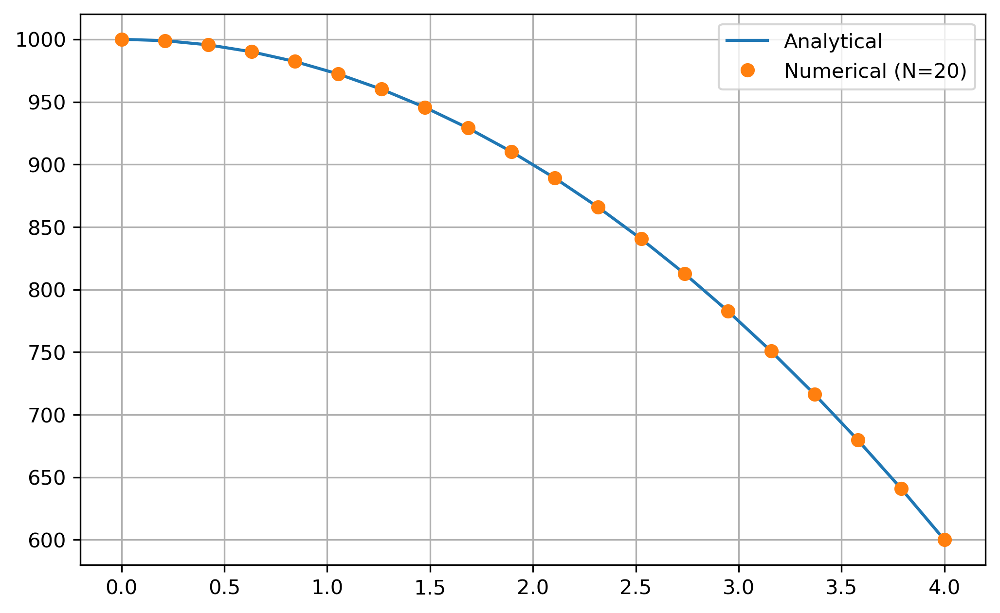
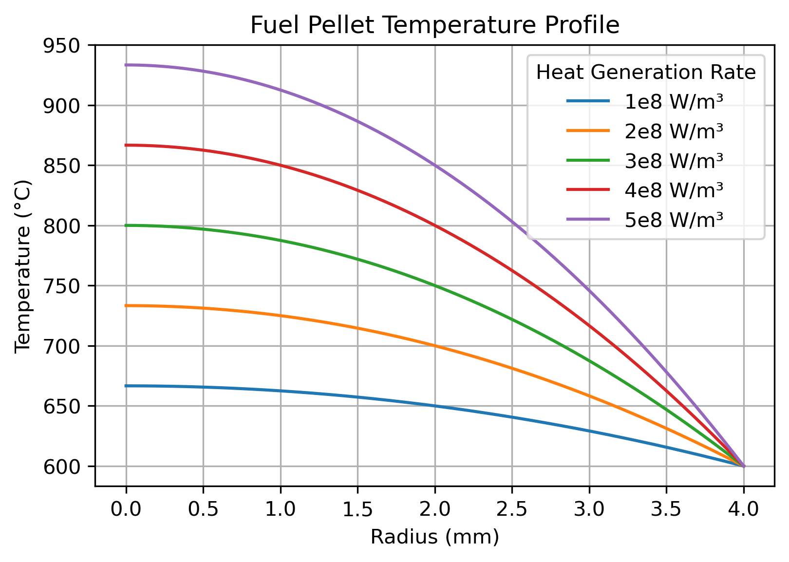
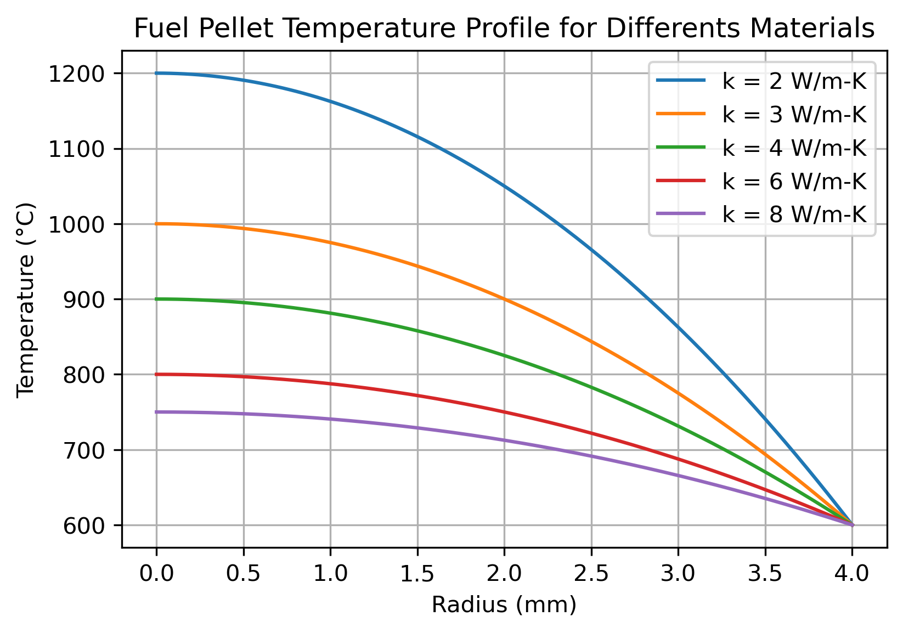
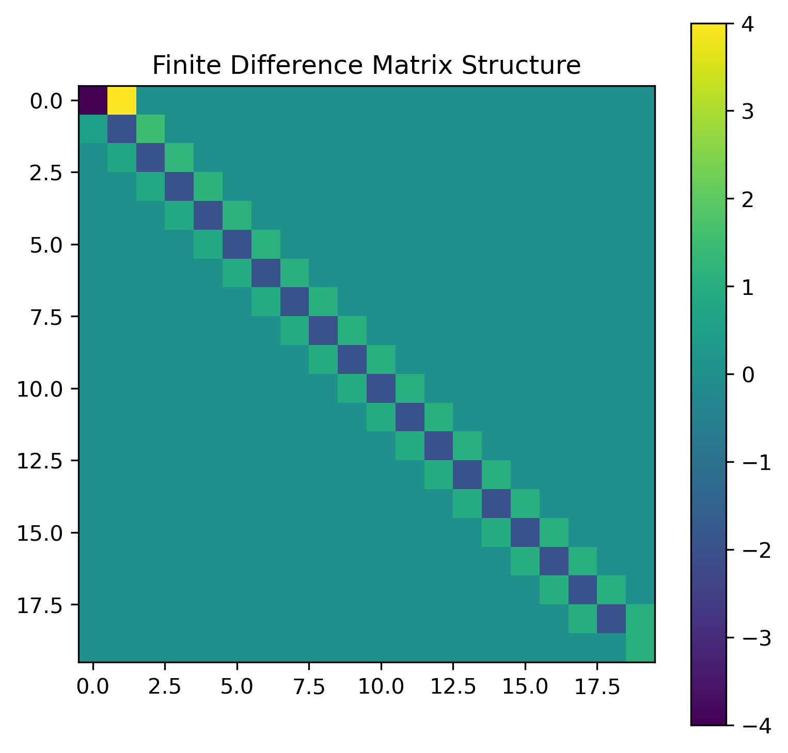
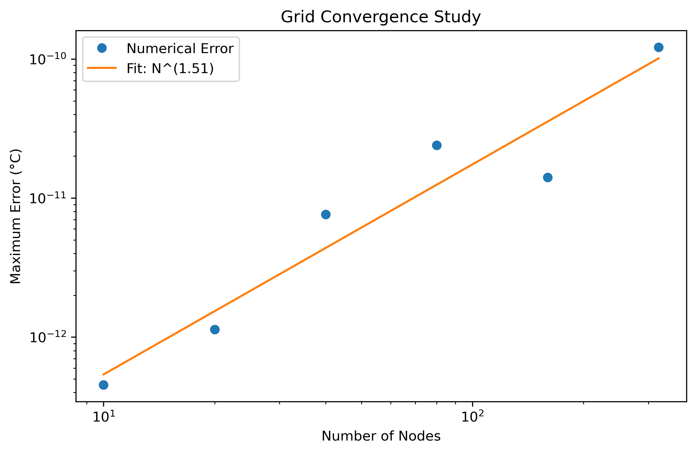
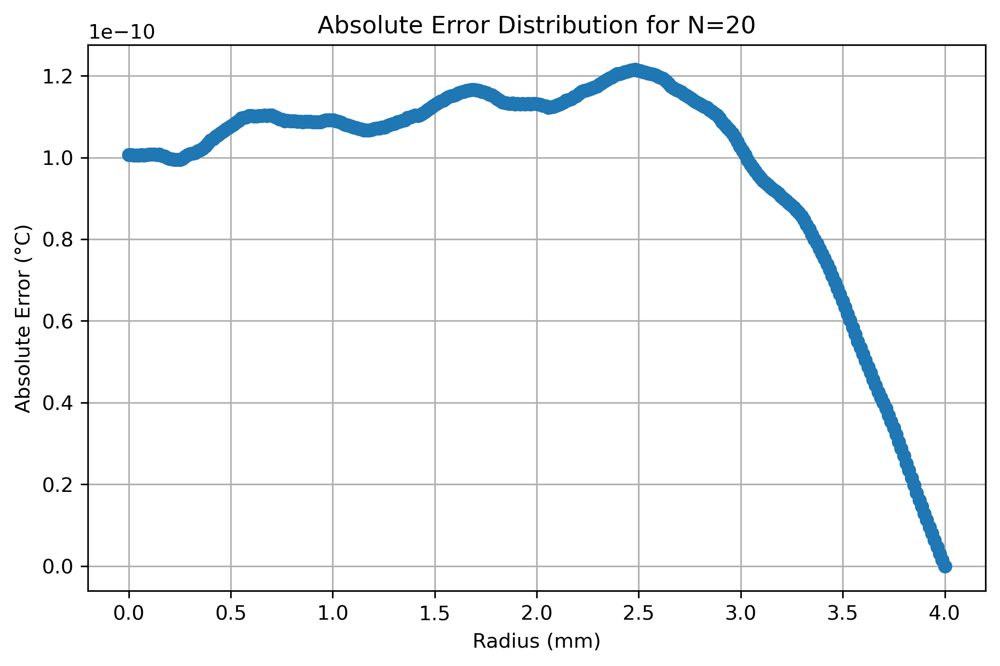

# Fuel Rod Thermal Analysis and Finite Difference Validation

## Overview

This project investigates radial heat conduction in a cylindrical nuclear fuel pellet.

The work combines:

- Analytical heat conduction solutions
- Parametric thermal studies
- Finite Difference Method (FDM) implementation
- Numerical validation against analytical solutions

The objective is to understand both the thermal behavior of nuclear fuel and the numerical techniques used to solve engineering heat transfer problems.

---

## Physical Problem

A cylindrical fuel pellet generates heat uniformly due to nuclear fission.

Under steady-state conditions, the radial heat conduction equation is:

$$
\frac{1}{r}
\frac{d}{dr}
\left(
r \frac{dT}{dr}
\right)
+ \frac{q'''}{k}
=
0
$$

where:

- $T$ = temperature
- $r$ = radial coordinate
- $q'''$ = volumetric heat generation rate
- $k$ = thermal conductivity

---

## Boundary Conditions

### Centerline Symmetry

$$
\frac{dT}{dr}=0
$$

At the center of the pellet, there is no heat flux due to symmetry.

### Surface Temperature

$$
T(R)=T_s
$$

The pellet surface temperature is prescribed.

---

## Analytical Solution

For constant thermal conductivity and uniform heat generation:

$$ T(r)=
T_s
+
\frac{q'''}{4k}
\left(
R^2-r^2
\right)
$$

This expression provides the temperature distribution throughout the fuel pellet.

---

## Model Parameters

| Parameter | Value |
|------------|--------|
| Pellet Radius | 4 mm |
| Surface Temperature | 600 °C |
| Thermal Conductivity | 3 W/m-K |
| Heat Generation Rate | $3\times10^8$ W/m³ |

---

# Part I – Analytical Thermal Studies

## Temperature Profile

The analytical solution was used to calculate the radial temperature distribution inside the fuel pellet.



The highest temperature occurs at the centerline, while the surface temperature remains fixed.

---

## Effect of Heat Generation Rate

Several power densities were evaluated:

$$
1\times10^8
\le q'''
\le
5\times10^8
\quad
W/m^3
$$

The centerline temperature increases linearly with heat generation rate.



---

## Effect of Thermal Conductivity

Different thermal conductivity values were analyzed:

$$
k=
2,\,
3,\,
4,\,
6,\,
8
\quad W/m-K
$$

Higher thermal conductivity reduces the temperature gradient and lowers the centerline temperature.



---

## Centerline Temperature Correlation

The analytical solution predicts:

$$ T_{center}=
T_s
+
\frac{q'''R^2}{4k}
$$

This relationship was verified numerically for multiple material properties and heat generation rates.


---

# Part II – Finite Difference Solver

## Numerical Method

The governing equation was discretized using central finite differences.

For interior nodes:

$$
\left(
1-\frac{\Delta r}{2r_i}
\right)T_{i-1}
-2T_i
+
\left(
1+\frac{\Delta r}{2r_i}
\right)T_{i+1}
=
-\frac{q'''}{k}\Delta r^2
$$

This formulation produces a linear system:

$$
A\,T=b
$$

which is solved using:

```python
np.linalg.solve(A, b)
```

---

## Matrix Structure

The finite difference discretization generates a sparse tridiagonal matrix.



Such matrices are typical in heat transfer and diffusion problems.

---

## Numerical Validation

The finite difference solution was compared against the analytical solution.



Excellent agreement was observed throughout the computational domain.

---

## Error Analysis

The absolute error was evaluated as:

$$
Error=
|T_{numerical}-T_{analytical}|
$$



Maximum errors were found to be on the order of:

$$
10^{-10}
\text{ to }
10^{-12}
$$

---

## Interpretation

The analytical solution is a quadratic function of radius:

$$ T(r)=
T_s
+
\frac{q'''}{4k}
(R^2-r^2)
$$

Since the finite difference formulation reproduces quadratic functions exactly, the discretization error is essentially eliminated.

The remaining discrepancy is dominated by floating-point roundoff error.

This provides strong verification that the solver has been implemented correctly.

---

# Engineering Applications

The methods demonstrated here are directly applicable to:

- Nuclear fuel performance analysis
- Reactor thermal design
- Fuel centerline temperature prediction
- Heat transfer simulations
- Diffusion and transport problems
- Finite Difference Method development
- Numerical verification and validation (V&V)

---

# Skills Demonstrated

- Heat conduction modeling
- Nuclear engineering fundamentals
- Analytical solution derivation
- Finite Difference Method (FDM)
- Matrix assembly
- Numerical linear algebra
- Solver verification
- Error analysis
- Scientific visualization
- Python scientific computing
- Git and GitHub workflow

---

# Future Improvements

Potential extensions include:

- Temperature-dependent thermal conductivity
- Non-uniform heat generation
- Fuel-cladding gap modeling
- Convective boundary conditions
- Transient heat conduction
- Finite Volume Method implementation
- OpenFOAM comparison
- Coupled neutronic-thermal simulations

---

# Tools

- Python
- NumPy
- Matplotlib

---