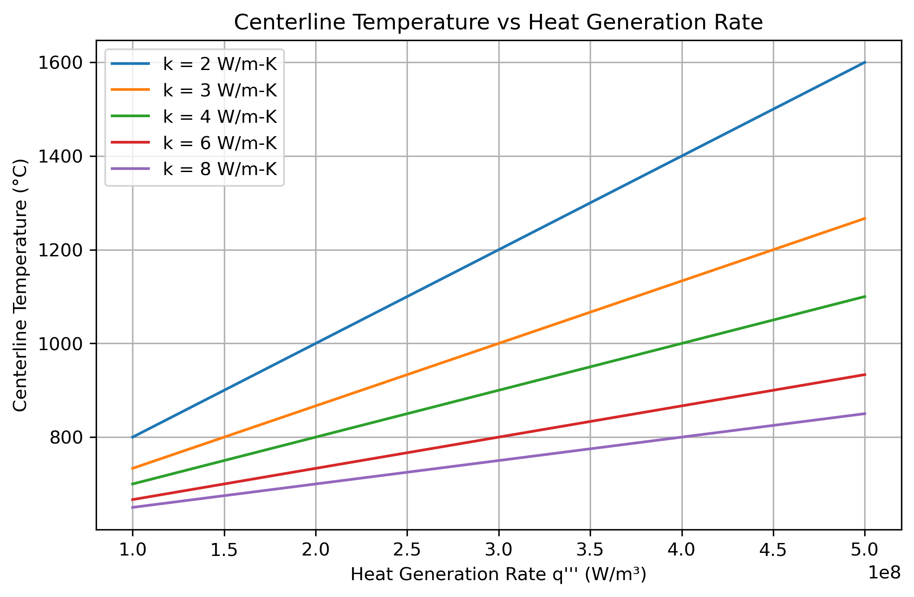

# Fuel Rod Thermal Solver


## Objective

This project models the radial temperature distribution inside a cylindrical nuclear fuel pellet under steady-state conditions with uniform volumetric heat generation.

The objective is to investigate how fuel temperature depends on:

- Heat generation rate
- Thermal conductivity
- Radial position within the pellet

The project also explores the sensitivity of centerline temperature to material properties and reactor power.

---

## Background

Nuclear fuel generates heat throughout its volume due to fission reactions.

Because heat is generated internally and removed at the surface by the coolant, a temperature gradient develops inside the fuel pellet.

The highest temperature occurs at the centerline, while the lowest temperature occurs at the outer surface.

Understanding this temperature distribution is essential for:

- Fuel performance analysis
- Thermal safety evaluations
- Reactor design
- Fuel material selection

---

## Governing Equation

For steady-state radial heat conduction in a cylinder with uniform heat generation:

```text
(1/r) d/dr ( r dT/dr ) + q'''/k = 0
```

where:

| Parameter | Description |
|------------|-------------|
| T | Temperature (°C) |
| r | Radial position (m) |
| q''' | Volumetric heat generation rate (W/m³) |
| k | Thermal conductivity (W/m·K) |

---

## Analytical Solution

Applying the appropriate symmetry and boundary conditions yields:

```text
T(r) = Ts + (q'''/(4k))(R² - r²)
```

where:

| Parameter | Description |
|------------|-------------|
| Ts | Surface temperature |
| R | Pellet radius |
| r | Radial coordinate |

The centerline temperature is obtained at r = 0:

```text
Tcenter = Ts + q'''R²/(4k)
```

---

## Tools

- Python
- NumPy
- Matplotlib

---

## Model Parameters

| Parameter | Value |
|------------|---------|
| Pellet Radius | 4 mm |
| Surface Temperature | 600 °C |
| Heat Generation Rate | 1×10⁸ – 5×10⁸ W/m³ |
| Thermal Conductivity | 2 – 8 W/m·K |

---

## Temperature Profile

The temperature distribution was calculated across the pellet radius for different heat generation rates.


### Observation

- Higher heat generation rates produce larger temperature gradients.
- Surface temperature remains fixed.
- Centerline temperature increases significantly with power.
- The temperature profile maintains its parabolic shape.

---

## Effect of Thermal Conductivity

The temperature distribution was also evaluated for different thermal conductivities.


### Observation

- Higher thermal conductivity reduces temperature gradients.
- Peak fuel temperature decreases as conductivity increases.
- Better heat-conducting materials operate at lower temperatures for the same power density.

---

## Centerline Temperature Sensitivity

The centerline temperature was calculated as a function of heat generation rate for several thermal conductivity values.



### Observation

- Centerline temperature increases linearly with power density.
- The slope decreases as thermal conductivity increases.
- Materials with higher conductivity provide improved thermal performance.

---

## Engineering Relevance

This simplified model captures the fundamental thermal behavior of nuclear fuel.

Although idealized, the analysis demonstrates key concepts used in:

- Fuel performance codes
- Thermal-hydraulic calculations
- Reactor safety analysis
- Nuclear fuel design
- Heat transfer modeling

The project illustrates how thermal conductivity and power density influence fuel temperature, two critical parameters in reactor operation.

---

## Skills Demonstrated

- Heat transfer modeling
- Analytical solution of differential equations
- Scientific computing with Python
- Parametric studies
- Engineering data visualization
- Nuclear engineering fundamentals
- Sensitivity analysis
- Git and GitHub workflow

---

## Key Findings

- Temperature follows a parabolic radial distribution.
- Peak temperature occurs at the fuel centerline.
- Increasing power density increases fuel temperature.
- Increasing thermal conductivity reduces peak temperature.
- Centerline temperature varies linearly with heat generation rate.
- Material properties strongly influence thermal performance.

---

## Future Improvements

Potential extensions include:

- Finite Difference Method (FDM) solution
- Numerical vs analytical comparison
- Temperature-dependent thermal conductivity
- Fuel-cladding gap modeling
- Transient heat conduction
- Multi-layer fuel rod analysis
- Coupling with coolant boundary conditions

---

## References

- Incropera, Fundamentals of Heat and Mass Transfer
- Todreas & Kazimi, Nuclear Systems
- Lamarsh & Baratta, Introduction to Nuclear Engineering
- Nuclear Fuel Thermal Analysis Literature